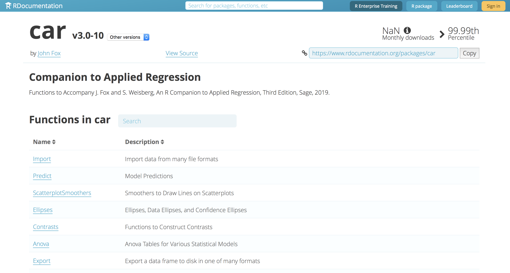

```{r setup, include=FALSE}
knitr::opts_chunk$set(echo = TRUE)
library(car)
library(tidyverse)
library(ggplot2)
library(plotly)
```
{width=500, height=400}<https://www.rdocumentation.org/packages/car/versions/1.2-16>

## Package Overview

### Summary
"car", the name of the package, is an acronym for Companion to Applied Regression. This package isn't used to perform Applied Regression techniques, it compliments these techniques by providing numerous functions that perform tests, creates visualizations, and transform data. To check the volidity of numerous regression techniques, we need to perform numerous tests on our results. This package provides the necessary tools to do so. 

### Package History
This package dates all the way back to 2001. In 2002, the package was described as "mostly functions for applied regression, linear models, and generalized linear models, with an emphasis on regression diagnostics, particularly graphical diagnostic methods." In 2010, Version 2.0 was released and the package became dependent on packages R (>= 2.1.1), stats, graphics, MASS, nnet, leaps, and survival. In Version 3.0, the package became only dependent on R (>= 3.2.0), and carData (>= 3.0-0). carData imports a large number of datasets which can be utilized by the functions in the car package. These dependence will be discussed in the next subsection. As of September 23rd, 2020, the package was on version 3.0-10. 


### Dependancy
The current version of the car package depends on carData (>= 3.0-0) and R (>= 3.5.0). However, the package also imports numerous other packages essential to the functions included in car. These packages are the following: abind, graphics, grDevices, lme4, maptools, MASS, mgcv, nlme, nnet, pbkrtest (>= 0.4-4), quantreg, rio, stats, and utils. For example, functions such as Anova, linearHypothesis, and poTest take models and objects outputted from MASS functions as inputs.

## Examples of Usage{.tabset}
To display the usage of the car package, we completed multiple linear regression and logistic regression and utilized car functions to check the necessary assumption required to be met to perform each type of regression (also used visualizations)

### Multiple Linear Regression
To perform multiple linear regression, we need to meet the following assumptions.

1. Errors have a mean value of 0
2. Homoscedasticity - the errors have constant variance across all levels of the independent variable(s)
3. The errors are normally distributed
4. The errors are independent of each other

#### Performing MLR
We selected NFL offensive data from the past 3 seasons and attempted to predict the number of points a team scores in a season using MLR.

```{r}
NFL.data <- read.csv("NFLCombinedData.csv")
NFL.model <- lm(PF ~., NFL.data)
```

#### Assumption 1
Assumption 1 states that in order to perform MLR, the mean value of the errors needs to be 0. We can check this assumption using car function residualPlots. To meet this assumption, there should be no clear trend on the plot and the mean value of the error should be close to 0. 
```{r}
residualPlot(NFL.model)
```

As we can see by the plot, there is no clear pattern in the plot, and the blue line indicates how the mean value of the errors is approximately 0.

#### Assumption 2
Assumption 2 states that there should be constant variance across all levels of the independent variables. This assumption can be checked using the same plot as above, with no clear pattern in the plot indicates homoscedasticity, or constant variance of the errors.

#### Assumption 3
Assumption 3 states that the errors should be normally distributed. This assumption is checked by plotting the residuals on a histogram. If the histogram is shaped like a bell-curve, a normal distribution, then the assumption is met. We can do this using car function densityPlot, plotting the residuals on the density plot to see the shape of the curve.
```{r}
densityPlot(NFL.model$residuals)
```

We can see that the plot of the residuals is approximately a bell curve, indicated that the errors are normally distributed and assumption 3 is met.

#### Assumption 4
Assumption 4 states that the errors need to be independent of each other. To do so, we use the Durbin-Watson test. The null hypothesis of this test states that errors in the model are not correlated. Setting our significance level at .01, if the p-value is from this test is below .01, we reject the null hypothesis, indicating the errors are correlated. For p-values greater than .01, we fail to reject the null hypothesis, indicating the errors are not correlated.
```{r}
durbinWatsonTest(NFL.model)
```
The p-value from this test is .972 and we fail to reject the null hypothesis, indicating that the errors are not correlated, and we have met assumption 4. 

Resource: https://www.statology.org/durbin-watson-test-r/


Using functions in the car package, we have checked and met all assumptions necessary to complete linear regression. 


### Logistic Regression
Logistic regression is used to predict binary response variables. This type of model predicts the probability of the binary response variable being true, having a value of 1, based on the other predictors. To complete logistic regression, we need to meet the following assumptions:

1. There is no linear relationship between the predictors and the logit of the outcome
2. There are no influential variables in the model
3. There is no multicollinearity

#### Performing Logistic Regression
Our model analyzes data of songs released by Spotify from 2010-2019. By analysing levels of energy, tempo, and danceability among other things, the model predict the likelihood of a song being included in a weekly top-100 list at least once. 
```{r}
spotify.data <- read.csv("spotify.csv")
spotify.data.numeric <- spotify.data[-c(1:2)]
logit.model <- glm(target~., data = spotify.data.numeric, family = binomial(link = "logit"))
```

#### Assumption 1
Assumption 1 ensures that there is a linear relationship between the predictors and the logit of the outcome. Because we can't complete this test using the car package, we will not be discussing how to test this assumption.

#### Assumption 2
Assumption 2 checks to see if there are any influential variables affecting the model. We can check this assumption by using the resudualPlot function. The function plots the standardized residuals on the y-axis. If a data point has a standardized residual with a magnitude greater than three, that point is considered influential. 
```{r}
residualPlot(logit.model, type = "rstandard")
```
Our model contain multiple influential values, as these data points have standardized residuals greater than 3. There are a couple ways for us to deal with these points. We can remove these influential points, use a log transformation on the data, or use non-parametric methods for analysis. 

#### Assumption 3
Assumption 3 checks to see if there is multicollinearity between the predictors. To check this assumption, we use the vif() function in the car package. VIF stands for Variance Inflation Factors. A value from 0-4 is considered low, 4-10 is considered moderate, and 10+ is considered high. Below we performed this analysis on our model. 

```{r}
vif(logit.model)
```
None of our predictors had a VIF level above 4, indicating there is no multicollinearity in the data. 

Resource: http://www.sthda.com/english/articles/36-classification-methods-essentials/148-logistic-regression-assumptions-and-diagnostics-in-r/ 

### Performing a one-way ANOVA
In order to illustrate how the car package provides numerous functions to make certain tests and visualizations easier, we conducted an assumption testing for a one-way ANOVA test using the package.
To perform a one-way ANOVA test, we needed to meet the following assumptions.

1. Assumption of independence
ANOVA assumes that the observations are random and that the samples taken from the populations are independent of each other. One event should not depend on another; that is, the value of one observation should not be related to any other observation.

2. Assumption of homogeneity of variance
ANOVA assumes that the variances of the distributions in the populations are equal. 

3. Assumption of normality
ANOVA is based on the F-statistic, where the F-statistic requires that the dependent variable is normally distributed in each group. Thus, ANOVA requires that the dependent variable is normally distributed in each group.

```{r}
GDP.data <- UN98
GDP.model <- aov(GDPperCapita ~ region, data = GDP.data)
```


#### Step 1: Assumption of independence
There is no way to test for independence of observations. This assumption can only be satisfied by correctly randomising your experimental design.
In this example, we will proceed under the assumption that all observations are independent.


#### Step 2: Assumption of homogeneity of variance
Assumption 2 states that there should be constant variance across all levels of the independent variables. 

A quick way to get an idea about the variability within each group is to conduct a levene test.
```{r}
leveneTest(GDP.model)
```

Setting a significance value of .01, we can reject the null hypothesis, meaning there IS sufficient evidence of non-constant variance across the different groups. So in this case, assumption 2 is not met.

Another way of checking this assumption is by using the residual plot below. We can see that there is a slight pattern in the plot which indicates that there isn't constant variance of the errors.
```{r}
residualPlot(GDP.model)
```


#### Step 3: Assumption of normality

The quantile-quantile plot or q-q plot plots the values as if they came from a normal distribution (the theoretically expected values) against the real values. The result is a graph that shows how far the real values stray from normality.

```{r}
qqPlot(GDP.model$residuals)
```

The plot shows that the dependent variable is not quite normal, since the real observations slightly deviate from the theoretically-derived normal values.


Using functions in the car package, we have checked and met all assumptions necessary to complete a one-way ANOVA test. 

## Similar Packages{.tabset}

### stats
stats is a package containing many useful functions for statistical calculations and random number generation. It is described as the main package for statistical functions. Analyses utilizing the stats package can range from probability distributions and statistical tests for hypothesis/assumption checking to model analysis and regression. There are also many functions which output visualizations to better understand the results of analysis.

### BLR
BLR is a package which performs a special case of linear regression named Bayesian linear regression, based on Bayesian inference. In essence, this type of linear regression relies on Bayes' Theorem (conditional probabilities) to update the probability for a hypothesis as more information becomes available; the union of the prior and posterior beliefs about the parameters is made possible using the likelihood function from the data. Here is Bayes' Theorem:
$$P(A|B) = \frac{P(B|A) * P(A)}{P(B)} $$

### MASS
MASS is a package containing both datasets and functions. It is very useful for estimate linear models. It also has functions for both simulation and data generation. One of these functions is the mvnorm() function which produces samples from a custom multivariate normal distribution.

### lars
lars is a package useful for performing least squares regression. The name of the package is an acronym for "least-angle regression". The key feature of this package is the many efficient procedures for fitting a lasso sequence, which is related to lasso regression.

## Reflection

### Pros
The functions within the car package are very streamline and easy-to-use. The functions require few parameters and the package is also very well-documented should any errors occur. Another benefit of the car package was how well it complements regression analysis given its numerous functions which help to check assumptions and perform tests to ensure that the results of any regression analysis are valid. Finally, a very helpful feature of the car package was the integrated visualization where many functions output clean graphics which clearly explain the results of whatever test we were performing.

### Cons
The main drawback we found when using the car package was how there was a noticeable overlap in usage/functionality with the stats package, as the stats package performs regression techniques. Additionally, we noticed that the initialization of car into an R environment can raise dependency errors which would be difficult to handle without having RTools installed to easily download those dependencies.

### Possible Improvements
First is improved error traceback, so if you input a variable from the data into a function it should tell you why the variable is incompatible - for example, the error message should be able to recognize the datat ype for an invalid parameter and display a message stating the necessary data type for that parameter. Next,since a lot of the car functions complement the regression techniques in the stats package, integration or bundling of the two packages would make analysis much more efficient. Having one package for regression analysis which includes both the regression techniques as well as the methods for checking assumptions would be a great improvement.
